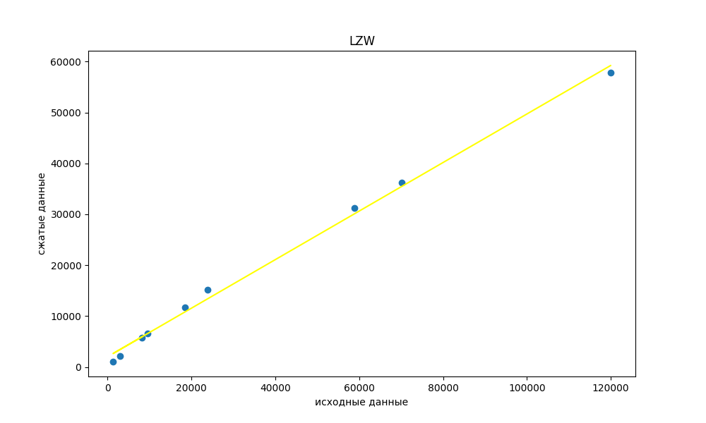

# LZW сжатие

## Содержание
- [Аннотация](#аннотация)
- [Коэффициент сжатия](#Коэффициент-сжатия)
- [Алгоритм сжатия LZW](#Алгоритм-сжатия-LZW)
- [Используемые файлы](#Используемые-файлы)
- [Измерения коэффициентов сжатия](№Измерения-коэффициентов-сжатия)
- [Исходные данные](#Исходные-данные)
- [Сравнение с zstd](#Сравнение-с-zstd)
- [Сравнение с дедупликацией данных](#Сравнение-с-дедупликацией-данных)
- [Итоги](#Итоги)

## Аннотация

***Сжатие без потерь*** (lossless data compression) - класс алгоритмов сжатия данных, при использовании которых закодированные данные однозначно могут быть восстановлены с точностью до бита.

Этот тип сжатия принципиально отличается от сжатия с потерями, при использовании которого распакованные данные отличаются от исходных, но степень отличия не существенна с точки зрения их дальнейшего использования.

Все методы сжатия данных основаны на простом логическом принципе: если наиболее часто встречающиеся элементы закодированы более короткими кодами, а реже встречающиеся – более длинными, то для хранения всех данных потребуется меньше места, чем если бы все элементы представлялись кодами одинаковой длины.

### Коэффициент сжатия
***Коэффициент сжатия*** — основная характеристика алгоритма сжатия. Она определяется как отношение объёма исходных несжатых данных к объёму сжатых данных.

Коэффициент сжатия $k = \frac{s_1}{s_2}$, где $s_1$ - объём исходных данных, $s_2$ - объём сжатых данных.

### Алгоритм сжатия LZW

Эта программа реализует сжатие и декомпрессию данных с использованием алгоритма LZW (Lempel-Ziv-Welch). Она включает две основные компоненты:

Сжатие:       - data_compression.cpp
Декомпрессия: - decoder.cpp

Этот алгоритм при сжатии сообщения динамически создаёт словарь фраз (library): определённым последовательностям символов ставятся в соответствие группы битов (коды) определённой длины.

Программа data_compression получает на вход файл в формате .txt и кодирует симолвы. Программа посимвольно считывает информацию из файла, сравнивает со словами из library (структура, содержащая размер словаря, слова и их кодировки), если такое слово есть, прожолжаем считывание и сравнивание, пока слово будет не найдено в словаре. Тогда предыдущее слово, которое было найдено в словаере, дабавляем в buffer, а текущее слово добавляем в словарик. Подробнее декодировании будет сказано далее.
Данные в словарике делятся на два типа: те, которые кодируются 1 байтом (0 - 127), и те, которые кодируются 2 байтами (128 - 32767).

**Кодирование:**
1) Заполняется начальный словарь символов (Алфавит). В входную фразу 'A' (подстроку, которую мы сейчас кодируем) считывается начальный символ строки.

2) Считывается очередной символ 'B' из строки.

3) Если 'B' - конец сообщения, то записывается код, соответствующий фразе 'A', иначе:
- Если фраза 'AB' уже имеется в словаре, входной фразе присваивается 'A' = 'AB', затем выполняется шаг 2.
- Если фразы 'AB' нет в словаре, записывается код, соответствующий фразе 'A', фраза $AB$ добавляется в словарь, входной фразе присваивается значение 'A' = 'B', затем выполняется шаг 2.

**Декодирование**

1) Заполняется начальный словарь символов. Во входную фразу 'A' (число, которое мы сейчас декодируем) заносится первый код декодируемого сообщения.

2) Считывается очередной код 'B'
из сообщения.

3) Если 'B' — это конец сообщения, выдаётся символ, соответствующий коду 'A', иначе:
- Если фразы под кодом 'AB' нет в словаре, выводится фраза, соответствующая коду 'A', а фраза с кодом 'AB' заносится в словарь. Затем выполняется шаг 2.
- Если фраза с кодом 'AB' есть в словаре, входной фразе присваивается 'A' = 'AB', затем выполняется шаг 2.

## Используемые файлы
1) **data_compression.cpp**: Содержит реализацию сжатия данных. Считывение файла и кодирование данных.
2) **decoder.cpp**: Содержит реализацию декомпрессии данных. Считывание закодированного файла и его декодирование.
3) **data_compression.h**: Заголовочный файл, определяющий функции и структуры, используемые как для сжатия, так и для декомпрессии.
4) **library_of_defines.h**: Заголовочный файл, содержащий макросы и коды ошибок, используемые в программе.
5) **library.txt**: Начальный словарь (алфавит).

## Измерения коэффициентов сжатия

### Исходные данные
Сжатие проводилось над 9 .txt файлами разного размера.

1) статьи National Geographic [сайт](https://www.nationalgeographic.com/)
2) Роман Джека Лонодна [сайт](https://martineden.com/)

### Сжатие

Процесс сжатия запускался командой
~~~
 make compress
~~~

График размера сжатых файлов от размера исходных. Он не совсем линейный. Примечательно, что k строго возрастает с ростом размера исходных файлов.

---

- график зависимости размера сжатых данных от размера исходных
---

Из анализа результатов можем получить следующие данные:

___
- коэффициент сжатия 1: $k_{1}$= 1.39 (исходный размер 3026 байт)
- коэффициент сжатия 2: $k_{2}$= 1.41 (исходный размер 8209 байт)
- коэффициент сжатия 3: $k_{3}$= 1.27 (исходный размер 1331 байт)
- коэффициент сжатия 4: $k_{4}$= 1.46 (исходный размер 9573 байт)
- коэффициент сжатия 5: $k_{5}$= 1.58 (исходный размер 18512 байт)
- коэффициент сжатия 6: $k_{6}$= 1.58 (исходный размер 11705 байт)
- коэффициент сжатия 7: $k_{7}$= 1.89 (исходный размер 58915 байт)
- коэффициент сжатия 8: $k_{8}$= 1.93 (исходный размер 70145 байт)
- коэффициент сжатия 9: $k_{9}$= 2.07 (исходный размер 119934 байт)

- Минимальный коэффициент сжатия:  $k_{min}$ = 1.27
- Максимальный коэффициент сжатия:  $k_{max}$ = 2.07
___

## Сравнение с zstd

Сравнение результатов выполнения программы с использованием алгоритма LZW и Zstandard может быть важным для оценки эффективности сжатия данных.

1) Алгоритм сжатия:
- LZW: Основан на словарном методе сжатия, где последовательности символов заменяются кодами из словаря.
- Zstandard: Это алгоритм сжатия данных с потерями и без потерь, который использует прогрессивные методы сжатия, включая современные алгоритмы сжатия без потерь и сложные алгоритмы сжатия с потерями.

2) Качество сжатия:
- LZW: Хорошо подходит для сжатия текстовых данных, но может не давать лучшего результата на некоторых типах данных, таких как изображения или аудио.
- Zstandard: Обеспечивает высокий уровень сжатия для различных типов данных благодаря использованию мощных алгоритмов сжатия.

3) Скорость сжатия и декомпрессии:
- LZW: Обычно обеспечивает хорошую скорость сжатия, но может быть менее эффективным на больших объемах данных.
- Zstandard: В зависимости от настроек, Zstandard может обеспечивать как высокую скорость сжатия, так и относительно быструю декомпрессию.

4) Использование ресурсов:
- LZW: Обычно требует меньше ресурсов для сжатия и декомпрессии по сравнению с Zstandard.
- Zstandard: Может потреблять больше ресурсов, особенно при более высоких уровнях сжатия и сложных типах данных.

5) Поддерживаемые форматы данных:
- LZW: Чаще всего используется для сжатия текстовых данных, таких как файлы, содержащие символы ASCII.
Zstandard: Поддерживает различные типы данных, включая текст, изображения, аудио и другие.

6) Портативность и доступность:
- LZW: Широко распространен и доступен в различных языках программирования.
- Zstandard: Также широко поддерживается и доступен во многих средах разработки и платформах.
В общем, выбор между LZW и Zstandard зависит от конкретных требований по сжатию данных, типа данных и доступных ресурсов.

## Сравнение с дедупликацией данных

Сжатие с общим обучаемым словарем и дедупликация данных представляют собой два различных метода уменьшения размера данных:

1) Сжатие с общим обучаемым словарем:
- Этот метод сжатия данных основан на использовании словаря, который может быть построен на основе статистики или обучен на предварительном наборе данных.
- Словарь содержит часто встречающиеся фрагменты данных, которые затем заменяются более короткими кодами или символами. При декомпрессии эти коды снова преобразуются в исходные фрагменты данных с использованием словаря.
- Примером такого метода является алгоритм сжатия LZW (Lempel-Ziv-Welch), который использует словарь для замены повторяющихся последовательностей символов более короткими кодами.

2) Дедупликация данных:
- Дедупликация данных, с другой стороны, предполагает удаление или замену повторяющихся фрагментов данных на ссылки или указатели на уже существующие эквивалентные фрагменты данных.
- При обнаружении дубликата данные либо удаляются, либо заменяются ссылками на уже существующие эквивалентные фрагменты.
- Такой подход часто используется в системах хранения данных или репликации, когда одни и те же данные могут быть повторно использованы в разных местах для экономии места.

Таким образом, основное различие между сжатием с общим обучаемым словарем и дедупликацией данных заключается в том, что первый метод заменяет фрагменты данных на более компактные коды с использованием словаря, тогда как второй удаляет или заменяет повторяющиеся фрагменты данных на ссылки или указатели на уже существующие эквивалентные фрагменты.

## Итоги

Средний коэффициет сжатия моего алгоритма в ходе эксперимента равен k = 1.57

Для улучшения показателей LZW следует применить немного другой способ кодирования, при котором размер кода не являлся бы фиксированным, а был бы минимальным достаточным для кодировки фразы и увеличивался при необходимости.
В моей реализации это 1 и 2 байта.

